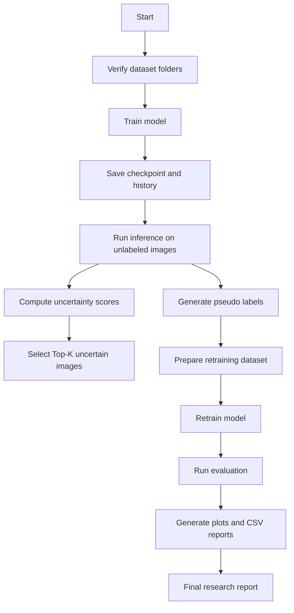
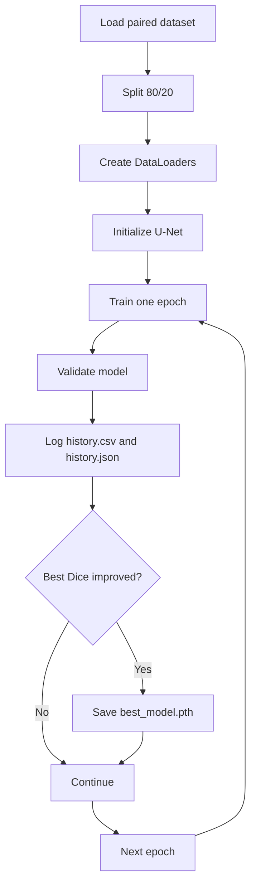
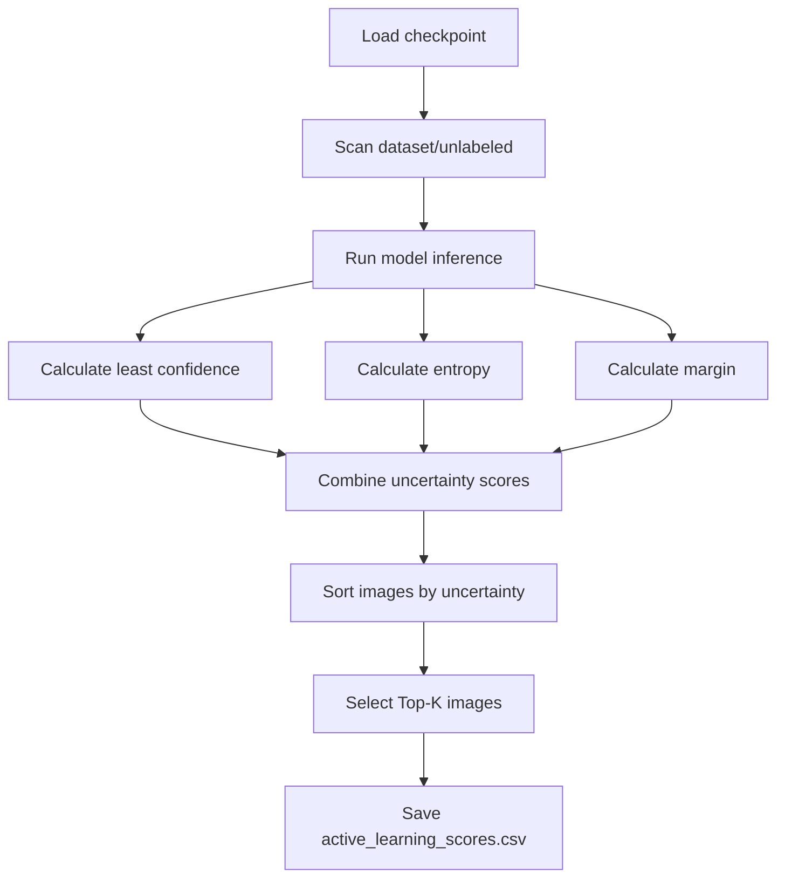
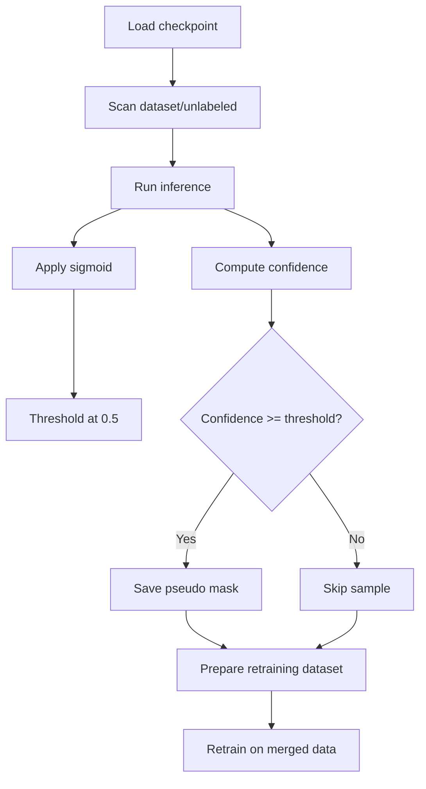
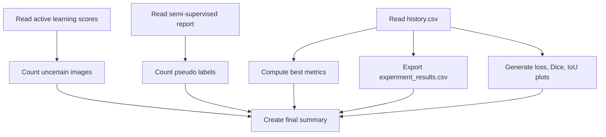

# Flowcharts

## Complete Research Pipeline

```mermaid
flowchart TD
    A[Start] --> B[Verify dataset folders]
    B --> C[Train model]
    C --> D[Save checkpoint and history]
    D --> E[Run inference on unlabeled images]
    E --> F[Compute uncertainty scores]
    F --> G[Select Top-K uncertain images]
    E --> H[Generate pseudo labels]
    H --> I[Prepare retraining dataset]
    I --> J[Retrain model]
    J --> K[Run evaluation]
    K --> L[Generate plots and CSV reports]
    L --> M[Final research report]
```

## Training Flow

```mermaid
flowchart TD
    A[Load paired dataset] --> B[Split 80/20]
    B --> C[Create DataLoaders]
    C --> D[Initialize U-Net]
    D --> E[Train one epoch]
    E --> F[Validate model]
    F --> G[Log history.csv and history.json]
    G --> H{Best Dice improved?}
    H -- Yes --> I[Save best_model.pth]
    H -- No --> J[Continue]
    I --> J
    J --> K[Next epoch]
    K --> E
```

## Active Learning Flow

```mermaid
flowchart TD
    A[Load checkpoint] --> B[Scan dataset/unlabeled]
    B --> C[Run model inference]
    C --> D[Calculate least confidence]
    C --> E[Calculate entropy]
    C --> F[Calculate margin]
    D --> G[Combine uncertainty scores]
    E --> G
    F --> G
    G --> H[Sort images by uncertainty]
    H --> I[Select Top-K images]
    I --> J[Save active_learning_scores.csv]
```

## Semi-Supervised Flow

```mermaid
flowchart TD
    A[Load checkpoint] --> B[Scan dataset/unlabeled]
    B --> C[Run inference]
    C --> D[Apply sigmoid]
    D --> E[Threshold at 0.5]
    C --> F[Compute confidence]
    F --> G{Confidence >= threshold?}
    G -- Yes --> H[Save pseudo mask]
    G -- No --> I[Skip sample]
    H --> J[Prepare retraining dataset]
    I --> J
    J --> K[Retrain on merged data]
```

## Evaluation Flow

```mermaid
flowchart TD
    A[Read history.csv] --> B[Compute best metrics]
    A --> C[Export experiment_results.csv]
    A --> D[Generate loss, Dice, IoU plots]
    E[Read active learning scores] --> F[Count uncertain images]
    G[Read semi-supervised report] --> H[Count pseudo labels]
    B --> I[Create final summary]
    F --> I
    H --> I
    C --> I
    D --> I
```

